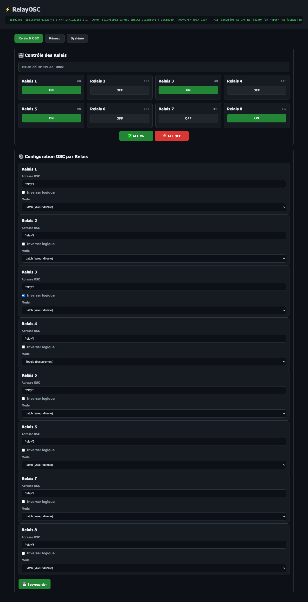
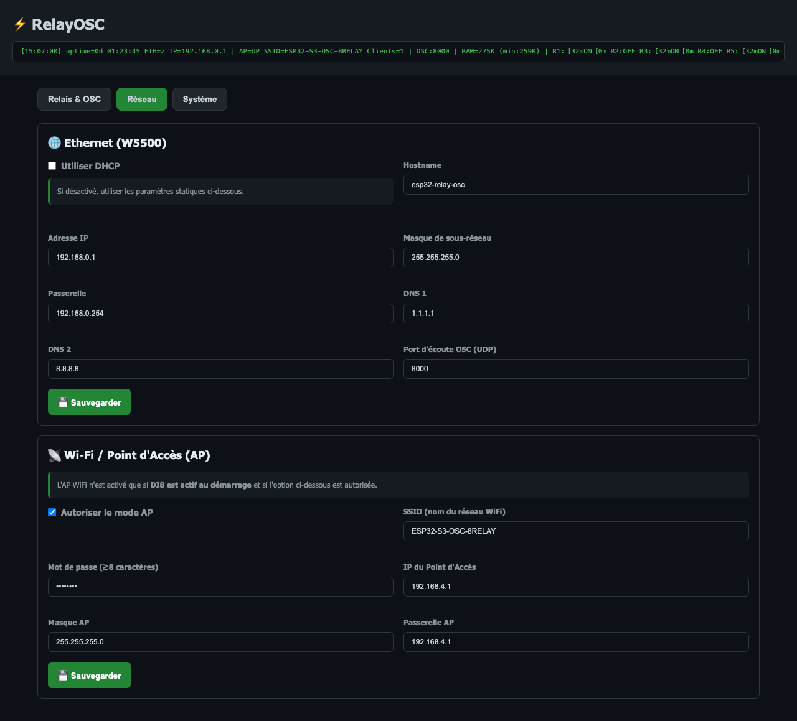
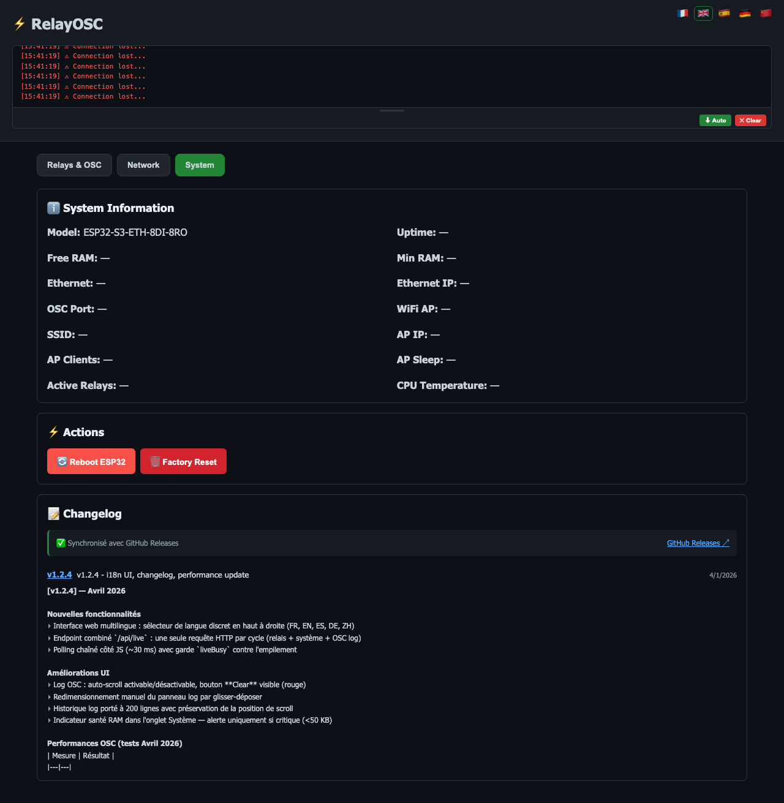

# ⚡ ESP32-S3-OSC-8Relay

Firmware pour la carte **Waveshare ESP32-S3-ETH-8DI-8RO** permettant de piloter **8 relais via le protocole OSC** (Open Sound Control) sur Ethernet, avec une **interface Web de configuration** accessible en Wi-Fi.



---

## 📋 Fonctionnalités

- **8 relais** contrôlables via OSC (UDP) sur Ethernet W5500
- **ALL ON / ALL OFF** : boutons web + commande OSC `/relay/all`
- **Interface Web** complète accessible via Wi-Fi AP (point d'accès)
- **Log unifié temps réel** dans le header web : messages système (vert) + OSC entrants (bleu) fusionnés
- **Affichage OSC entrants** : adresse, type tag et valeur en temps réel
- **QR code WiFi** dans l'onglet Réseau pour connexion rapide
- **Température CPU** affichée dans l'onglet Système
- **Deux réseaux séparés** : Ethernet pour l'OSC, Wi-Fi pour la configuration
- **Persistance** : configuration et état des relais sauvegardés en flash (NVS)
- **Modes de relais** : Latch (valeur directe ON/OFF) ou Toggle (basculement)
- **Inversion logique** configurable par relais
- **Mise en veille AP** : timeout configurable (défaut 5 min, 0 = toujours actif)
- **LED RGB** de statut (WS2812) : bleu au boot, vert = OK, rouge = erreur
- **Watchdog** matériel (10s) pour redémarrage automatique en cas de crash
- **Protection mutex** contre les accès concurrents Web/OSC aux relais
- **Portail captif** : redirection automatique vers l'interface Web à la connexion WiFi
- **Boucle OSC prioritaire** : drain multi-paquets, sauvegarde NVS différée, ~0.5-1.2ms de latence

---

## ⚡ Performances OSC (v1.2.0)

Résultats mesurés sur Ethernet W5500 (UDP, 192.168.0.1:8000) :

| Métrique | Résultat |
|---|---|
| **Latence UDP envoi** | ~100 µs (min 32 µs) |
| **Ping réseau W5500 (ICMP)** | 0.3 - 0.77 ms (avg 0.54 ms) |
| **Burst 8 relais** | ~1 ms pour les 8 |
| **Throughput max** | ~70 000 msg/s |
| **Latence totale OSC → relais** | **~0.5 - 1.2 ms** |

Décomposition de la latence totale :
- Réseau UDP W5500 : ~0.3-0.7 ms
- Parsing OSC ESP32 : ~0.01-0.05 ms
- Écriture I2C PCA9554 (100 kHz) : ~0.2-0.5 ms

---

## 🔧 Matériel Compatible

### Carte principale
| Paramètre | Valeur |
|---|---|
| **Carte** | [Waveshare ESP32-S3-ETH-8DI-8RO](http://www.waveshare.com/wiki/ESP32-S3-ETH-8DI-8RO) |
| **MCU** | ESP32-S3-WROOM-1U-N16R8 |
| **Flash** | 16 MB (QD) |
| **PSRAM** | 8 MB (OPI) |
| **CPU** | Dual-core Xtensa LX7, 240 MHz |
| **Ethernet** | W5500 (SPI) |
| **Relais** | 8x via PCA9554 (I2C expander) |
| **Entrées digitales** | 8x opto-isolées |
| **LED RGB** | WS2812 sur GPIO38 |
| **Buzzer** | GPIO46 |

### Brochage matériel

| Fonction | Broches |
|---|---|
| **Ethernet SPI (W5500)** | CS=16, SCK=15, MISO=14, MOSI=13, INT=12 |
| **I2C (PCA9554)** | SDA=42, SCL=41, Adresse=0x20 |
| **DI8 (WiFi trigger)** | GPIO11 (actif LOW) |
| **LED RGB** | GPIO38 (WS2812) |
| **Buzzer** | GPIO46 |

---

## 🚀 Installation

### Prérequis

- [PlatformIO](https://platformio.org/) (CLI ou extension VS Code)
- Câble USB-C data+power
- Python 3.x

### Compilation et upload

```bash
# Cloner le dépôt
git clone https://github.com/NeOdYmS/ESP32-S3-OSC-8Relay.git
cd ESP32-S3-OSC-8Relay

# Compiler
pio run

# Compiler et uploader
pio run --target upload

# Moniteur série (115200 bauds)
pio device monitor
```

### Dépendances (gérées automatiquement par PlatformIO)

| Bibliothèque | Usage |
|---|---|
| [Ethernet_Generic](https://github.com/khoih-prog/Ethernet_Generic) | Pilote W5500 SPI |
| [ArduinoJson](https://arduinojson.org/) v6.21+ | API REST JSON |
| [Adafruit NeoPixel](https://github.com/adafruit/Adafruit_NeoPixel) v1.12+ | LED RGB WS2812 |

---

## 🌐 Architecture Réseau

Le firmware utilise **deux interfaces réseau séparées** :

```
┌─────────────────────────────────────────────────┐
│              ESP32-S3-ETH-8DI-8RO               │
│                                                   │
│   Wi-Fi AP (192.168.4.1)      Ethernet W5500     │
│   ┌─────────────┐             ┌──────────────┐   │
│   │ Interface    │             │ OSC UDP      │   │
│   │ Web :80     │             │ Port 8000    │   │
│   └──────┬──────┘             └──────┬───────┘   │
└──────────┼────────────────────────────┼──────────┘
           │                            │
     📱 Navigateur               🎛️ Console OSC
     (config Wi-Fi)             (QLab, Millumin,
                                 TouchOSC, etc.)
```

| Interface | Rôle | IP par défaut |
|---|---|---|
| **Wi-Fi AP** | Interface Web de configuration | `192.168.4.1` |
| **Ethernet W5500** | Réception OSC (UDP) | `192.168.0.1` |

---

## 📡 Configuration Wi-Fi (Interface Web)

### Connexion

1. Connectez-vous au réseau Wi-Fi **`ESP32-S3-OSC-8RELAY`**
2. Mot de passe : **`S3Relay!`**
3. Ouvrez **http://192.168.4.1** dans un navigateur

### Onglet Relais & OSC

Contrôle en temps réel des 8 relais et configuration des adresses OSC par relais.


- **Boutons ON/OFF** : contrôle direct de chaque relais
- **ALL ON / ALL OFF** : active ou désactive les 8 relais d'un coup
- **Log unifié** : bandeau temps réel affichant messages système (vert) et OSC entrants (bleu)
- **Adresse OSC** : chemin OSC personnalisable (ex: `/relay/1`, `/scene/light/3`)
- **Inverser logique** : inverse l'état physique du relais
- **Mode** : Latch (valeur directe) ou Toggle (basculement à chaque impulsion)

### Onglet Réseau

Configuration de l'Ethernet (W5500) et du point d'accès Wi-Fi.



- **Ethernet** : IP statique ou DHCP, masque, passerelle, DNS, port OSC
- **Wi-Fi AP** : SSID, mot de passe, IP du point d'accès, **délai de mise en veille** (0 = infini)
- **QR code WiFi** : généré automatiquement pour connexion rapide au point d'accès

### Onglet Système

Informations système en temps réel, redémarrage et réinitialisation usine.



- **Uptime** : temps depuis le dernier redémarrage
- **RAM libre / min** : mémoire disponible et minimum atteint
- **Ethernet** : état de connexion et IP
- **WiFi AP** : état, SSID, IP, nombre de clients, mise en veille
- **Relais actifs** : nombre de relais allumés / 8
- **Température CPU** : en temps réel

---

## 🎛️ Protocole OSC

### Paramètres de connexion

| Paramètre | Valeur par défaut |
|---|---|
| **Transport** | UDP sur Ethernet (W5500) |
| **IP** | `192.168.0.1` |
| **Port** | `8000` |

### Adresses OSC par défaut

| Relais | Adresse OSC |
|---|---|
| Relais 1 | `/relay/1` |
| Relais 2 | `/relay/2` |
| Relais 3 | `/relay/3` |
| Relais 4 | `/relay/4` |
| Relais 5 | `/relay/5` |
| Relais 6 | `/relay/6` |
| Relais 7 | `/relay/7` |
| Relais 8 | `/relay/8` |
| **Tous** | **`/relay/all`** |

> Les adresses individuelles sont personnalisables via l'interface Web.

### Commandes système OSC

| Adresse | Valeur | Description |
|---|---|---|
| `/ap` | `1` | Allumer le point d'accès Wi-Fi |
| `/ap` | `0` | Éteindre le point d'accès Wi-Fi |
| `/ap/enable` | *(aucune)* | Allumer le point d'accès Wi-Fi |
| `/reboot` | `1` | Redémarrer l'ESP32 |

> L'AP s'éteint automatiquement après le **délai de mise en veille configuré** (5 min par défaut, configurable via l'interface Web, 0 = toujours actif). La commande `/ap 1` le rallume à tout moment.

### Types de données acceptés

| Type OSC | Tag | Comportement |
|---|---|---|
| **Integer** (int32) | `i` | `0` = OFF, non-zéro = ON |
| **Float** (float32) | `f` | `0.0` = OFF, non-zéro = ON |
| **True** | `T` | ON (pas de donnée supplémentaire) |
| **False** | `F` | OFF (pas de donnée supplémentaire) |

### Modes de fonctionnement

- **Latch** : la valeur reçue définit directement l'état (0 = OFF, 1 = ON)
- **Toggle** : une valeur ON (non-zéro / `T`) bascule l'état ; une valeur OFF est ignorée

### Exemples d'envoi

#### Avec `oscsend` (macOS/Linux)
```bash
# Installer liblo
brew install liblo

# Allumer le relais 1
oscsend 192.168.0.1 8000 /relay/1 i 1

# Éteindre le relais 1
oscsend 192.168.0.1 8000 /relay/1 i 0

# Allumer tous les relais
oscsend 192.168.0.1 8000 /relay/all i 1

# Éteindre tous les relais
oscsend 192.168.0.1 8000 /relay/all i 0

# Éteindre le Wi-Fi AP
oscsend 192.168.0.1 8000 /ap i 0

# Rallumer le Wi-Fi AP
oscsend 192.168.0.1 8000 /ap i 1

# Toggle le relais 4
oscsend 192.168.0.1 8000 /relay/4 f 1.0
```

#### Avec Python (`python-osc`)
```python
from pythonosc import udp_client

client = udp_client.SimpleUDPClient("192.168.0.1", 8000)

# Allumer le relais 3
client.send_message("/relay/3", 1)

# Éteindre le relais 3
client.send_message("/relay/3", 0)

# Allumer tous les relais
client.send_message("/relay/all", 1)

# Éteindre tous les relais
client.send_message("/relay/all", 0)

# Éteindre le Wi-Fi AP
client.send_message("/ap", 0)

# Rallumer le Wi-Fi AP
client.send_message("/ap", 1)
```

#### Logiciels compatibles

Tout logiciel capable d'envoyer de l'OSC via UDP :
- **QLab** (macOS)
- **Millumin** (macOS)
- **TouchOSC** (iOS/Android/Desktop)
- **Open Stage Control**
- **Chataigne**
- **Max/MSP**, **Pure Data**, **SuperCollider**
- **Reaper** (via ReaScript ou extensions OSC)

---

## 🔌 API REST

L'interface Web utilise une API REST accessible sur le Wi-Fi AP (`http://192.168.4.1`).

| Méthode | Endpoint | Description |
|---|---|---|
| `GET` | `/api/config` | Configuration complète (JSON) |
| `GET` | `/api/relays/status` | État des 8 relais `[true, false, ...]` |
| `POST` | `/api/relays/{n}` | Changer l'état du relais n (`{"state": true}`) |
| `POST` | `/api/relays/all` | ALL ON/OFF (`{"state": true}` ou `false`) |
| `POST` | `/api/config/relays` | Sauvegarder la config des relais |
| `POST` | `/api/config/network` | Sauvegarder la config réseau |
| `POST` | `/api/config/ap` | Sauvegarder la config Wi-Fi AP |
| `POST` | `/api/system/reboot` | Redémarrer l'ESP32 |
| `POST` | `/api/system/factoryreset` | Réinitialisation usine |
| `GET` | `/api/system/status` | État système (uptime, RAM, ETH, CPU temp, relais...) |
| `GET` | `/api/osc/log` | Derniers messages OSC reçus (ring buffer) |
| `POST` | `/api/config/network/reload` | Recharger la config réseau sans reboot |

### Exemple avec `curl`

```bash
# Lire la configuration
curl http://192.168.4.1/api/config

# Lire l'état des relais
curl http://192.168.4.1/api/relays/status

# Allumer le relais 0
curl -X POST http://192.168.4.1/api/relays/0 \
  -H "Content-Type: application/json" \
  -d '{"state": true}'

# Allumer tous les relais
curl -X POST http://192.168.4.1/api/relays/all \
  -H "Content-Type: application/json" \
  -d '{"state": true}'

# État système
curl http://192.168.4.1/api/system/status
```

---

## 📁 Structure du Projet

```
├── platformio.ini          # Configuration PlatformIO
├── include/
│   ├── config.h            # Structures de configuration (AppCfg, RelayCfg)
│   ├── led_status.h        # Contrôle LED RGB (WS2812)
│   ├── logger.h            # Système de logs colorés (série)
│   ├── mutex.h             # Mutex FreeRTOS pour accès concurrent
│   ├── network_mgr.h       # Gestionnaire réseau (Ethernet + WiFi AP)
│   ├── osc_router.h        # Parseur et routeur OSC (EthernetUDP)
│   ├── pca9554.h           # Driver PCA9554 (I2C I/O expander)
│   ├── watchdog.h          # Watchdog matériel
│   └── web_ui.h            # Interface Web HTML embarquée
├── src/
│   ├── main.cpp            # Point d'entrée, setup/loop
│   ├── config.cpp          # Persistance NVS (Preferences)
│   ├── led_status.cpp      # Implémentation LED
│   ├── logger.cpp          # Implémentation logs
│   ├── network_mgr.cpp     # Init Ethernet W5500 + WiFi AP
│   ├── osc_router.cpp      # Réception et parsing OSC
│   ├── pca9554.cpp         # Communication I2C relais
│   └── watchdog.cpp        # Implémentation watchdog
└── docs/
    └── screenshots/        # Captures d'écran de l'interface
```

---

## 🏷️ Valeurs par Défaut (usine)

| Paramètre | Valeur |
|---|---|
| **IP Ethernet** | `192.168.0.1` |
| **Masque Ethernet** | `255.255.255.0` |
| **Passerelle** | `192.168.0.254` |
| **Port OSC** | `8000` |
| **DHCP** | Désactivé |
| **SSID Wi-Fi AP** | `ESP32-S3-OSC-8RELAY` |
| **Mot de passe AP** | `S3Relay!` |
| **IP Wi-Fi AP** | `192.168.4.1` |
| **Hostname** | `esp32-relay-osc` |
| **Adresses OSC** | `/relay/1` à `/relay/8` |
| **Mode relais** | Latch (tous) |
| **Inversion** | Désactivée (tous) |
| **Mise en veille AP** | `5` minutes (0 = toujours actif) |

---

## 🔄 Séquence de Démarrage

1. **LED bleue** : initialisation en cours
2. Initialisation I2C → PCA9554 (relais)
3. Restauration des états de relais depuis NVS
4. Chargement de la configuration depuis NVS
5. Initialisation Ethernet W5500 (IP statique ou DHCP)
6. Démarrage du point d'accès Wi-Fi
7. Démarrage du serveur Web (port 80)
8. Démarrage du routeur OSC (UDP)
9. **LED verte** : système prêt

En cas d'erreur critique (PCA9554 non trouvé) : **LED rouge** permanente.

---

## 📜 Licence

Ce projet est fourni tel quel, sans garantie. Usage libre pour projets personnels et professionnels.

---

## 🙏 Crédits

- **Waveshare** pour la carte ESP32-S3-ETH-8DI-8RO
- **Ethernet_Generic** par Khoi Hoang
- **ArduinoJson** par Benoît Blanchon
- **Adafruit NeoPixel** par Adafruit Industries
- **qrcode-generator** v1.4.4 par Kazuhiko Arase (MIT License)
